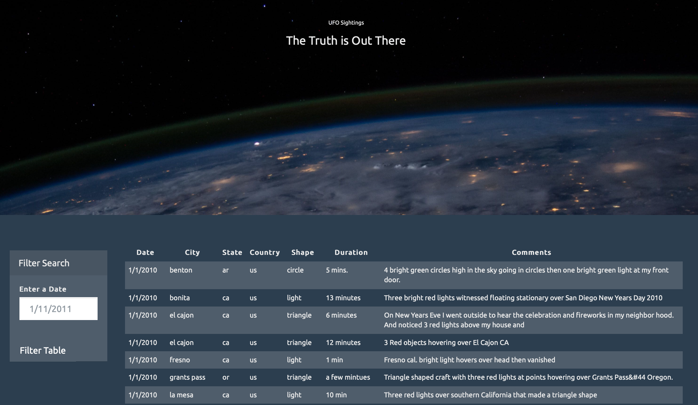
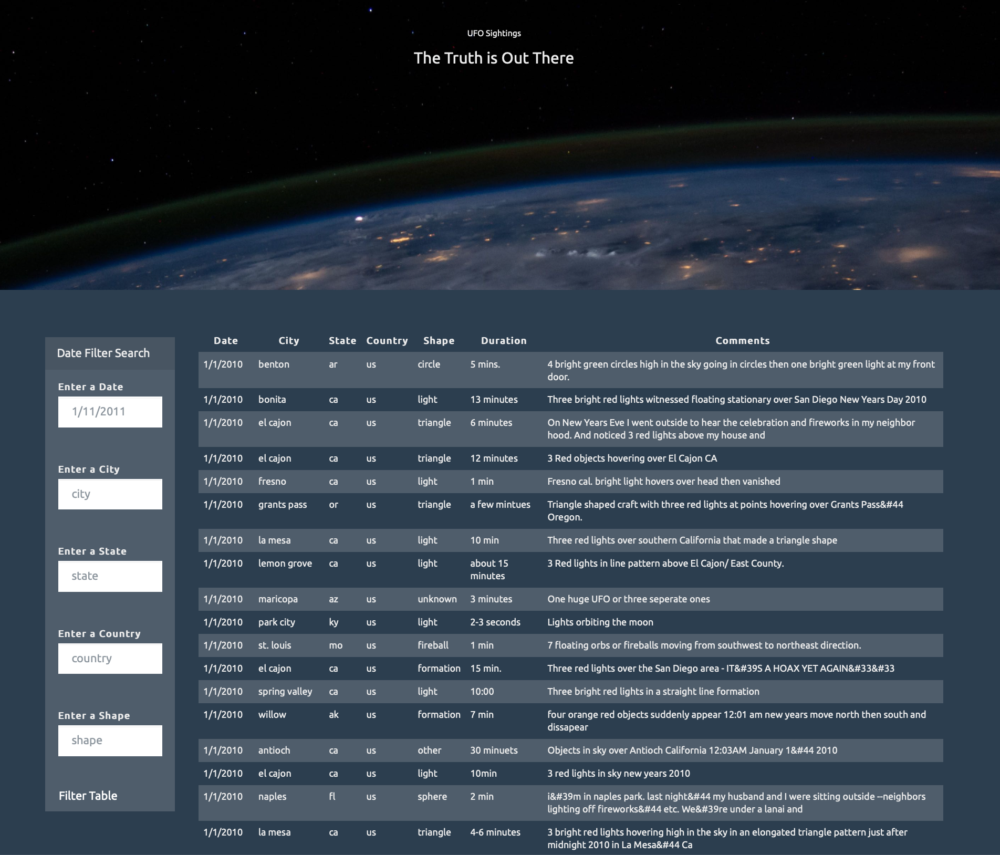

# UFO Sightings Web Application

## Introduction
In this challenge a web application was build to create a table dynamically based upon the UFO Sightings Data and allow the users to filter the table data for specific values.

## Data
* [UFO Sightings Data](UFO-level-1/static/js/data.js)

## Automatic Table and Date Search
* Create a basic [HTML](UFO-level-1/index.html) web page
* Appends a table to the web page using the UFO dataset provided
* Allow users to search through the `date/time` column to find rows that match the input

## Multiple Search Categories
* Allow users to set multiple filters and search for UFO sightings using the following criterias:
  1. `date/time`
  2. `city`
  3. `state`
  4. `country`
  5. `shape`
  
  

## Tools
* JavaScript
* HTML
* CSS

## Copyright

Trilogy Education Services © 2021. All Rights Reserved.
